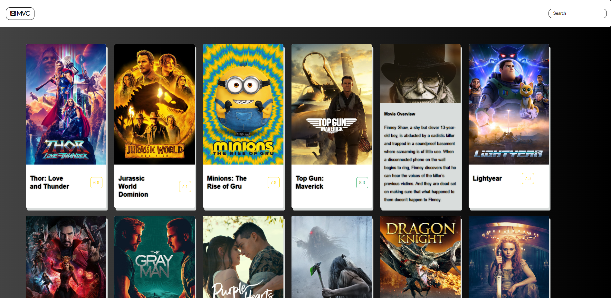
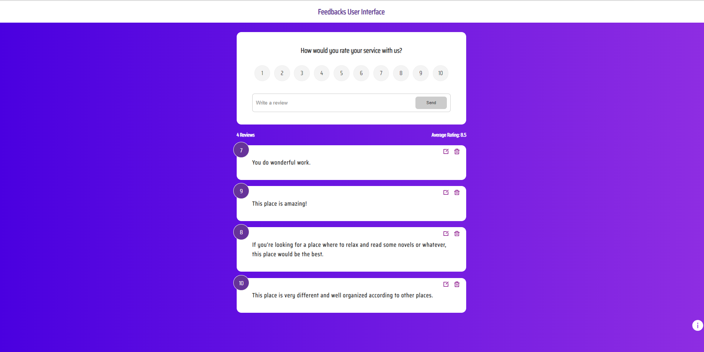
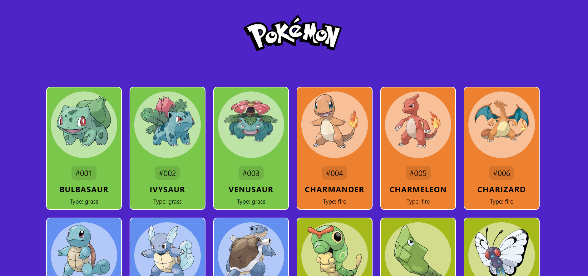

  

<h1>
  Hey there
  
</h1>

I'm Oded from Israel, a 4th year software engineering student 
with knowledge of software design,
development, and testing.
enthusiastic about developing practical
and time-saving software solutions.
In my free time I solve problems on LeetCode  and read tech articles from geeksforgeeks  and W3schools .

<h2>
Technologies and tools 🛠️
</h2>

  
  
   
 

 
 
 
  
 
<<<<<<< HEAD

=======
 
>>>>>>> e23896bc28531113d0c47bb6cac7095784c30ba6

<h2>
Examples of projects 👨‍💻
</h2>

 MVC movie catalog - Development of an online movie catalog
from TMDB API, using HTML, CSS and
JavaScript 

 HBT hotel - Development of a virtual hotel website
called HBT, using HTML and CSS 

 feedback-UI - Simulation for the feedback page of any website/system/application which provides a service, using REACT.JSX and CSS3

<<<<<<< HEAD
=======

>>>>>>> e23896bc28531113d0c47bb6cac7095784c30ba6
<h2> Connect with me </h2>

   &nbsp; 
     &nbsp; 

